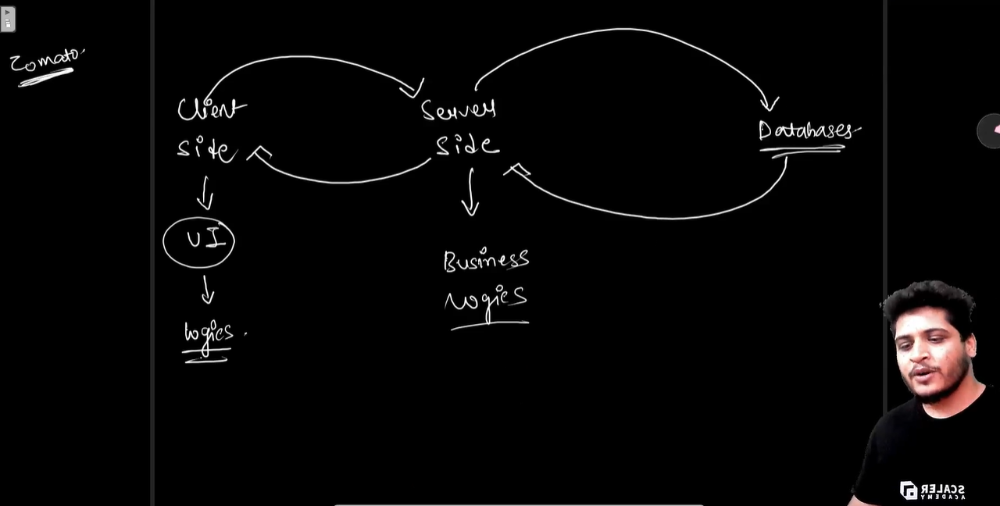
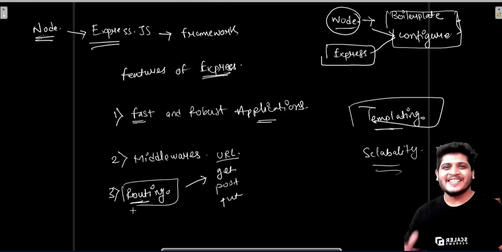

# "Can we create server-side applications using only Node.js?"

Yes, you can create server-side applications using Node.js alone. Here's a simple explanation:

Node.js is a runtime environment that allows you to run JavaScript code on the server side. This means you can write programs using JavaScript that run on your computer instead of in a web browser.

With Node.js, you can create all sorts of server-side applications, such as web servers, APIs (Application Programming Interfaces), real-time chat applications, and more.

Here's how it works:

1. **Handling HTTP Requests**: Node.js has built-in modules that allow you to create web servers and handle HTTP requests. This means you can receive requests from web browsers or other clients, process them, and send back responses.

2. **Event-Driven Architecture**: Node.js uses an event-driven architecture, which means it's designed to handle multiple requests simultaneously without getting bogged down. This makes it well-suited for building highly scalable server applications.

3. **npm**: Node.js has a package manager called npm (Node Package Manager) that allows you to easily install and manage libraries and modules created by other developers. This means you can leverage a vast ecosystem of open-source tools and libraries to help you build your server-side applications.

4. **Asynchronous Programming**: Node.js is particularly good at handling asynchronous operations, such as reading from files or making network requests. This allows your server to handle many tasks concurrently without waiting for one task to finish before starting another.

In summary, Node.js enables you to write server-side applications using JavaScript, with the ability to handle HTTP requests, leverage a vast ecosystem of libraries, and scale to handle large numbers of concurrent connections efficiently.

# "Why should we use Express.js?"

Express.js is a web application framework for Node.js that simplifies the process of building server-side applications, particularly web servers and APIs. While Node.js provides the basic tools for creating server-side applications, Express.js adds a layer of abstraction and additional features that make development faster, easier, and more organized. Here are some reasons why you might want to use Express.js:

1. **Simplicity**: Express.js provides a minimalist and unopinionated framework that makes it easy to get started with building server-side applications. It simplifies common tasks like routing, handling HTTP requests and responses, and managing middleware.

2. **Routing**: Express.js has a robust routing system that allows you to define routes for different URLs and HTTP methods. This makes it easy to create RESTful APIs and handle different types of requests.

3. **Middleware**: Express.js has a middleware system that allows you to add functionality to your application in a modular way. Middleware functions can handle tasks like logging, authentication, error handling, and more. This makes it easy to add features to your application without cluttering your main codebase.

4. **Template Engines**: Express.js supports various template engines like Pug, EJS, and Handlebars, which make it easy to generate HTML dynamically based on data from your server. This is useful for building dynamic web pages or rendering server-side views.

5. **Error Handling**: Express.js provides built-in error handling middleware that makes it easy to handle errors gracefully and return appropriate error responses to clients. This helps improve the robustness and reliability of your applications.

6. **Community and Ecosystem**: Express.js has a large and active community of developers who contribute plugins, middleware, and other tools to extend its functionality. This means you can leverage a rich ecosystem of third-party packages to add features to your applications quickly and easily.

In summary, while Node.js provides the foundation for building server-side applications, Express.js adds a layer of abstraction and additional features that streamline the development process and make it easier to build robust, scalable, and maintainable applications.