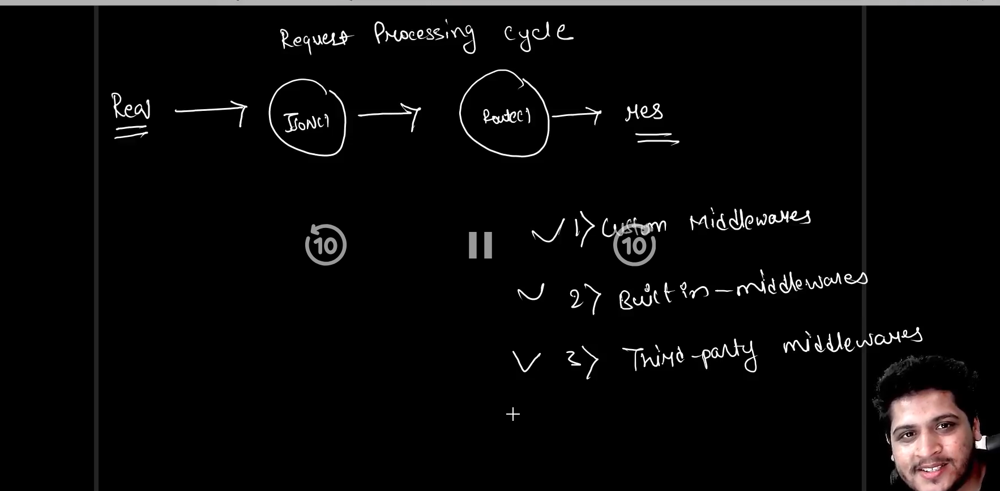

Middleware is like the glue that helps different software components or systems work together smoothly. Imagine you have different parts of a machine, and you need something to connect them and make sure they communicate properly. That's what middleware does in the world of software.

Think of it as a mediator or a translator between different programs or systems. It sits between them, facilitating communication, managing data, and handling tasks like security, logging, and monitoring.

For example, let's say you have a web application that needs to interact with a database. Middleware can help manage the communication between the two, making sure data gets sent back and forth correctly and securely.

In short, middleware acts as a bridge, helping different software pieces to work together efficiently without needing to know all the technical details of each other.