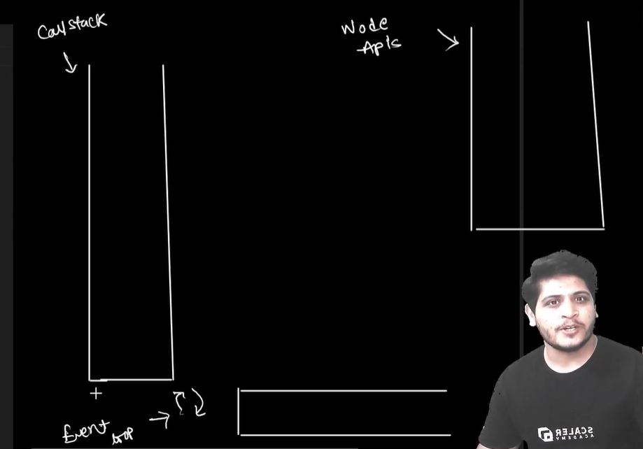
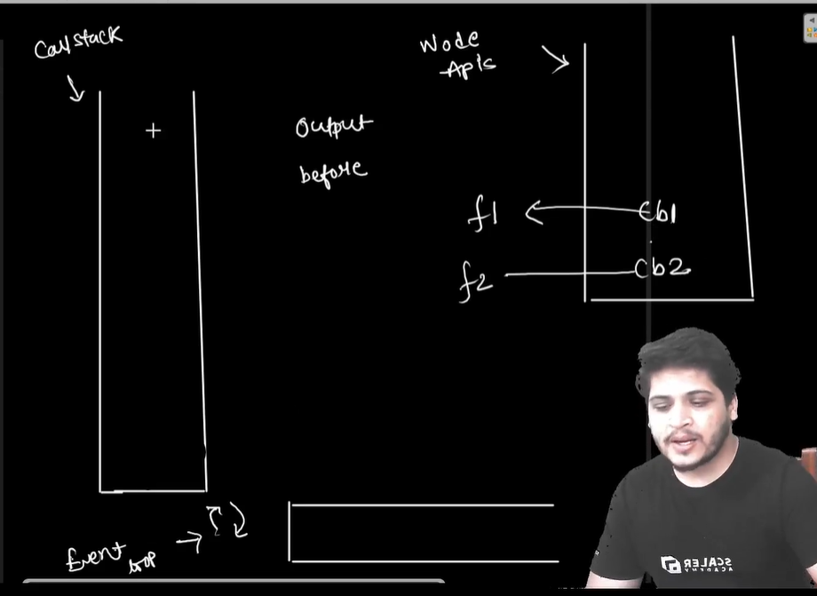
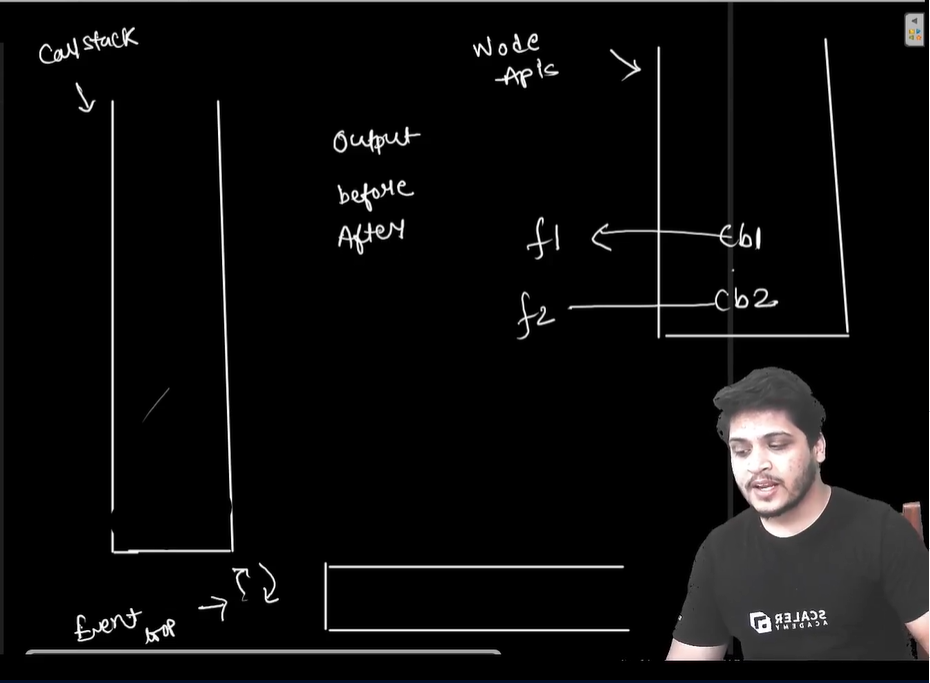
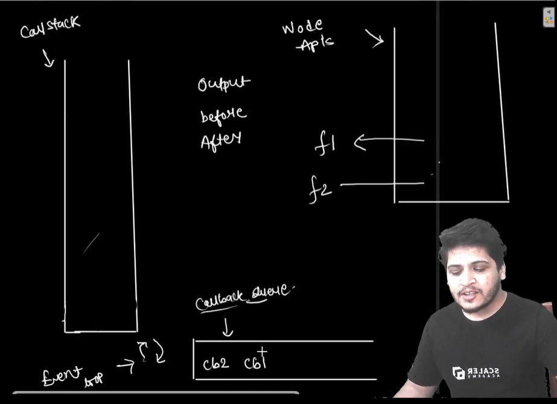

let's break down the execution flow of the provided code in the context of the call stack, Node APIs, callback queue, and event loop:

1. **Initialization**: 
   - The code starts by requiring the `fs` module and defining two callback functions `cb1` and `cb2`.
   - It then logs "First Line" to the console.

2. **`fs.readFile("f1.txt", cb1)`**:
   - This line initiates a non-blocking I/O operation to read the contents of "f1.txt".
   - Since `fs.readFile` is an asynchronous function in Node.js, it doesn't block the execution, and `cb1` is passed as a callback function to be executed when the file reading operation completes.
   - The `fs.readFile` operation is handed over to the Node APIs, and the main thread continues executing synchronous code.
   
3. **`fs.readFile("f2.txt", cb2)`**:
   - Similarly, this line initiates another non-blocking I/O operation to read the contents of "f2.txt", with `cb2` as the callback function.
   - This operation also goes to the Node APIs, and the main thread continues executing synchronous code.
   
4. **Synchronous Code Execution**:
   - The code continues synchronously and logs "Last Line" to the console.

5. **Callback Execution**:
   - At this point, the synchronous code execution is complete.
   - The Node APIs handle the file reading operations asynchronously.
   - Once the file reading operations are completed, their corresponding callback functions (`cb1` and `cb2`) are pushed to the callback queue.

6. **Event Loop**:
   - The event loop continuously monitors the call stack and the callback queue.
   - Since the call stack is empty after the synchronous code execution, the event loop checks the callback queue.
   - It notices that there are callbacks waiting to be executed.

7. **Callback Queue**:
   - The event loop picks up the callbacks from the callback queue one by one and pushes them onto the call stack for execution.
   - First, `cb1` is pushed onto the call stack.

8. **Execution of `cb1`**:
   - Inside `cb1`, the error is checked first. If there's no error, it logs the data from "f1.txt" to the console.

9. **Execution of `cb2`**:
   - After `cb1` is executed, `cb2` is pushed onto the call stack.
   - Inside `cb2`, the error is checked, and if there's no error, it logs the data from "f2.txt" to the console.

10. **Completion**:
    - After both callbacks are executed, the call stack becomes empty.
    - The event loop continues to monitor for any pending tasks.

11. **Program End**:
    - The event loop doesn't find any pending tasks, so the program ends.

**Final Output**:
```
First Line
Last Line
File 1 Data : I am File 1 , You are reading file 1 data.
File 2 Data : I am File 2 , You are reading file 2 data.
```